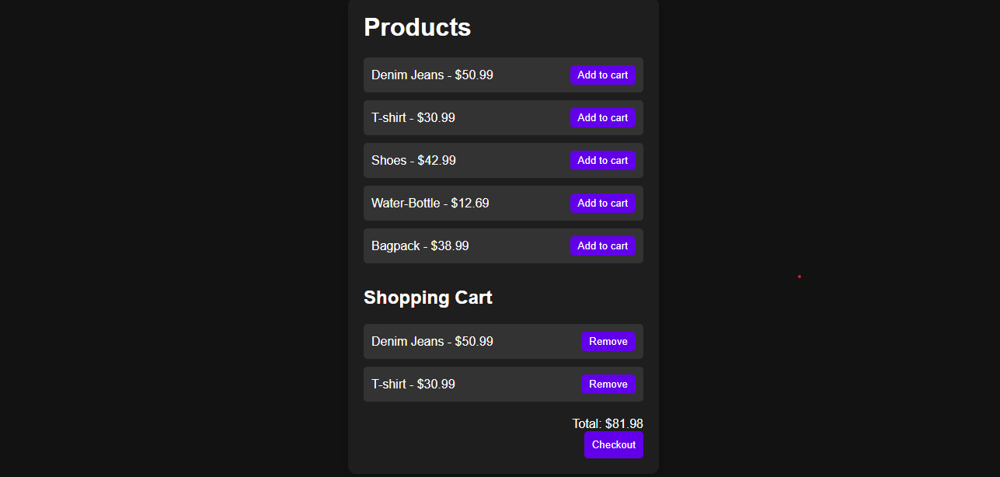

# Simple E-Commerce Cart

A simple e-commerce cart application built using HTML, CSS, and JavaScript. Users can browse products, add them to a shopping cart, remove items, and view the total price.

## Features

- Display products
- Add products to cart
- Remove products from cart
- Calculate total cart price
- Cart data saved using localStorage
- Checkout button to clear the cart
- Dark-themed interface

## Technologies Used

- HTML
- CSS
- JavaScript
- Local Storage

## Screenshot



## Live Demo

[View Live Demo](https://anushka-kamble04.github.io/ecommerce-cart-page/)

## How to Run

1. Clone the repository:

   ```bash
   git clone https://github.com/Anushka-Kamble04/ecommerce-cart-page.git
   ```
2. Open the project folder.
3. Open `index.html` in your browser.
